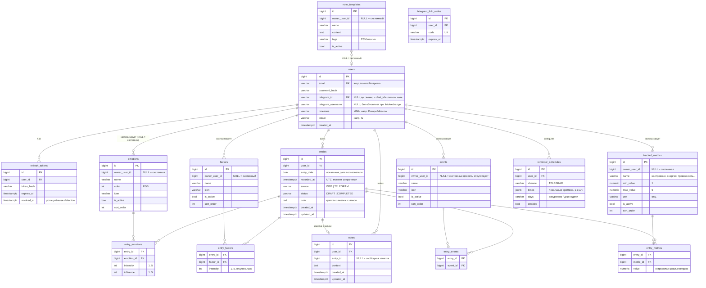
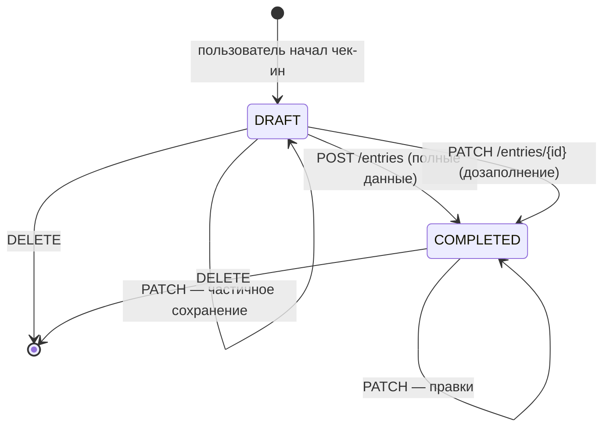

# Доменная модель

> Сущности, их связи, правила и жизненный цикл. Схема БД на модуль; здесь описана логическая модель.

## Глоссарий

| Термин | Значение |
|---|---|
| **Чек-ин / Запись (Entry)** | одна сессия заполнения: эмоции + факторы + события + метрики. 1–3 раза в день |
| **Эмоция (Emotion)** | элемент справочника; в записи имеет интенсивность и влияние |
| **Интенсивность** | сила эмоции, шкала 1–5 |
| **Влияние (Influence)** | субъективный эффект эмоции на пользователя, шкала 1–5 |
| **Фактор (Factor)** | причина/контекст, повлиявший на состояние (сон, работа, погода…) |
| **Событие (Event)** | конкретное жизненное событие пользователя |
| **Метрика (Tracked metric)** | отслеживаемый показатель со шкалой 1–5: настроение, энергия, тревожность, либидо… |
| **Системный элемент** | элемент справочника, общий для всех (`owner_user_id IS NULL`) |
| **Черновик (Draft)** | начатый, но не завершённый чек-ин |

## ERD

## Схемы БД и принадлежность

| Схема | Таблицы |
|---|---|
| `auth` | `users`, `refresh_tokens`, `telegram_link_codes` |
| `catalog` | `emotions`, `factors`, `events`, `tracked_metrics` |
| `entry` | `entries`, `entry_emotions`, `entry_factors`, `entry_events`, `entry_metrics` |
| `note` | `notes`, `note_templates` |
| `notification` | `reminder_schedules` (+ очередь «due», см. ниже) |

Правила:
- FK — только внутри своей схемы. Связи между модулями — по идентификаторам без FK.
- Справочные записи (`emotions`, `factors`, `events`, `tracked_metrics`, `note_templates`) поддерживают паттерн «системное + персональное»: `owner_user_id IS NULL` — системное, иначе персональное. Пользователь не может править системные записи; вместо этого деактивирует их и создаёт свои.

## Жизненный цикл записи

- **Флоу чек-ина**: эмоции (интенсивность + влияние каждой) → факторы → события → опционально метрики → (опц.) заметка.
- Один чек-ин может быть сохранён одной командой `POST /entries` с вложенными данными либо постепенно как `DRAFT`.
- `source` фиксирует клиент (`WEB` / `TELEGRAM`) — полезно для аналитики вовлечённости.
- Ограничение: не более 5 записей на пользователя в сутки (включая черновики) — защита от абьюза, значение конфигурируемо.

## Таймзоны и «быстрый возврат к дате»

- Все моменты времени — `timestamptz` в UTC.
- `entry_date` — календарная дата **в таймзоне пользователя** («за какое число» запись). Запись в 23:30 по UTC+3 попадает на свой локальный день.
- `entry_date` вычисляется на сервере из `recorded_at` + `users.timezone` и хранится явно.
- Индексы: `(user_id, entry_date)` — переход к дате; `(user_id, entry_date, status)` — календарь месяца.

Это даёт: `GET /entries?date=…` — все чек-ины дня; `GET /entries/calendar?month=…` — дни месяца с числом записей для календарика (фронтенд и бот). См. [api-design.md](api-design.md).

## Аналитика и доступ к данным

`analytics` в MVP не имеет собственных таблиц: агрегации (таймлайны, топ эмоций, корреляции «эмоция ↔ фактор/событие», календарь заполнений) считаются SQL-запросами по схеме `entry` **через публичный query-порт модуля entry** (`EntryQueryPort`), а не прямым SQL к чужой схеме. При распиле (см. [architecture-overview.md](architecture-overview.md)) аналитика получает собственный read-model, наполняемый событиями `EntryCompleted/Updated/Deleted`.

## Системные пресеты (seed)

| Справочник | Системный набор |
|---|---|
| Эмоции | радость, спокойствие, благодарность, гордость, интерес / грусть, тревога, злость, страх, стыд, вина, усталость, одиночество |
| Метрики | настроение, энергия, тревожность, либидо (шкала 1–5; можно отключать и добавлять свои) |
| Факторы | сон, работа/учёба, спорт, общение, еда, погода, здоровье, деньги |
| События | без пресетов — события строго персональны |
| Шаблоны заметок | 2–3 системных (например, «Итоги дня», «Триггеры дня») |

Seed выполняется Liquibase-чейнджлогом с context `seed` (см. [liquibase-migrations.md](liquibase-migrations.md)). `ADMIN` может пополнять системные наборы.

## Ключевые валидации

| Правило | Значение |
|---|---|
| `entry_emotions.intensity` | целое 1–5 |
| `entry_emotions.influence` | целое 1–5 |
| `entry_factors.intensity` | целое 1–5, nullable |
| `entry_metrics.value` | в пределах шкалы своей метрики |
| Состав записи | ≥ 1 эмоция для `COMPLETED`; факторы/события/метрики — 0..N; для `DRAFT` — может быть пусто |
| Название элемента справочника | 1–100 символов; уникально в рамках пользователя |
| Текст заметки | ≤ 10 000 символов |
| Записей в сутки | ≤ 5 |
| Часов в расписании напоминаний | 1–3 локальных времени |
