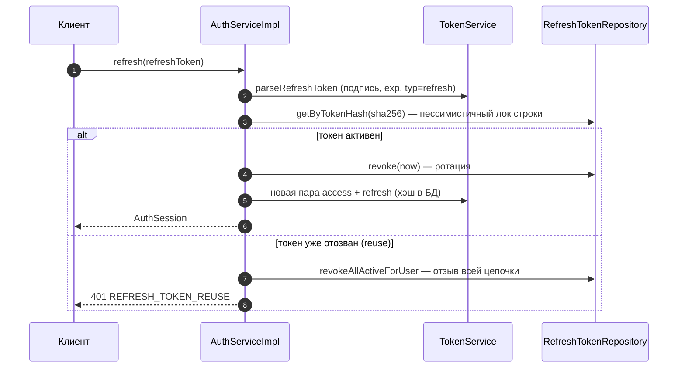
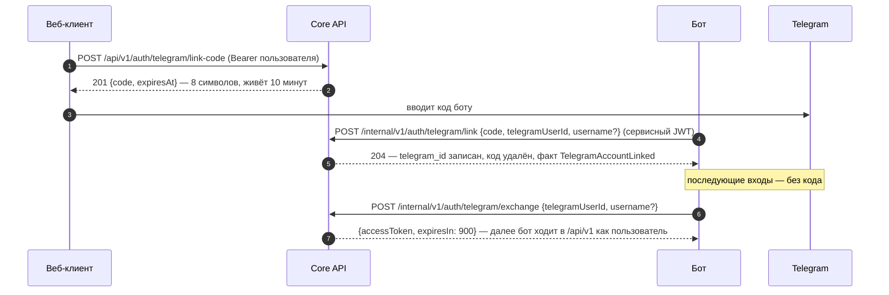
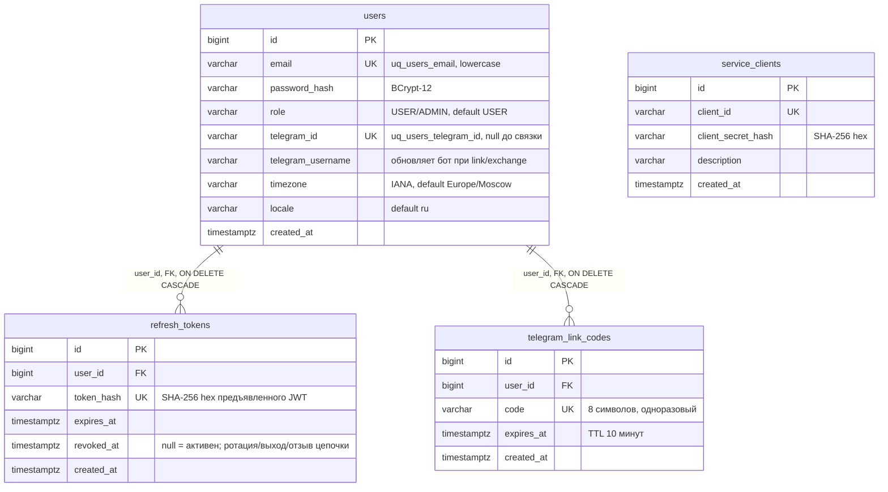

# Модуль auth

> Аутентификация и identity: аккаунты, пароли, JWT (access + refresh с ротацией), связка Telegram, сервисные токены. Владелец схемы БД `auth`.
> Правила границ модулей — [architecture-overview.md](../architecture-overview.md), REST-контракт — [api-design.md](../api-design.md), локальный запуск — [local-dev.md](../local-dev.md).

## 1. Ответственность и границы

**Делает:**

- регистрация (email + пароль), вход, смена пароля, обновление timezone/locale аккаунта;
- выпуск и проверка JWT: пользовательские access/refresh (ротация + reuse detection) и сервисные токены доверенных клиентов;
- одноразовые коды связки аккаунта с Telegram и обмен «telegram_id → пользовательский access-токен»;
- хранение данных аккаунта: email, пароль, роль, таймзона, локаль, привязка Telegram (таблица `auth.users`).

**Не делает:**

- не владеет HTTP: контроллеры живут в `apps/rest-api` и являются тонкими адаптерами над портами модуля;
- не публикует `/me` напрямую: модуль `user` — публичное «лицо» профиля и читает данные через `UserAccountPort`;
- не рассылает уведомления (это `notification`) и не строит графики (это `analytics`).

| Параметр | Значение |
|---|---|
| Схема БД | `auth` (чейнджлоги Liquibase внутри модуля) |
| Публичный пакет | `com.aura.auth.api` (`@NamedInterface("api")` — единственная точка входа) |
| Зависимости | только `modules/shared` (+ Spring / Spring Security OAuth2 JOSE) |
| Потребители | `apps/rest-api` (security-фильтр, контроллеры), модуль `user` (профиль); событиями воспользуется `notification` (этап 7) |
| Кандидат в микросервис | да — будущий сервис «Identity» ([architecture-overview.md](../architecture-overview.md) §8) |

## 2. Публичный контракт (`com.aura.auth.api`)

### 2.1 Порты

| Порт | Методы | Кто вызывает |
|---|---|---|
| `AuthService` | `register`, `login`, `refresh`, `logout` | `AuthController` (`/api/v1/auth/*`) |
| `UserAccountPort` | `getProfile`, `updateProfile`, `changePassword` | модуль `user` (`UserProfileAdapter` → `/api/v1/me`) |
| `TelegramLinkPort` | `createLinkCode`, `link`, `exchange` | `AuthController` (выдача кода), `InternalAuthController` (`/internal/v1/auth/telegram/*`) |
| `ServiceTokenPort` | `issue` | `InternalAuthController` (`/internal/v1/auth/service-token`) |
| `AccessTokenVerifier` | `verify(token): TokenPrincipal?` | `JwtAuthenticationFilter` приложения (security) |
| `AuthEventsPort` | `userRegistered`, `telegramAccountLinked` | реализуется модулями-потребителями, модуль вызывает все реализации |

Модели контракта: `AccountView`, `TelegramAccountView`, `AuthSession`, `RegisterCommand`, `LoginCommand`, `LinkCodeIssued`, `TelegramLinkCommand`, `TelegramExchangeCommand`, `AccessTokenIssued`, `ServiceTokenIssued`, `ClientCredentials`, `UpdateProfileCommand`, `ChangePasswordCommand`, `TokenPrincipal`, `TokenType` (`ACCESS`/`SERVICE`). Контракт содержит только команды, факты и «взгляды» — без сущностей и JWT-деталей.

### 2.2 Ошибки (RFC 9457 problem+json)

| Исключение | HTTP | `code` | Когда |
|---|---|---|---|
| `EmailAlreadyExistsException` | 409 | `EMAIL_ALREADY_EXISTS` | регистрация: email занят |
| `InvalidCredentialsException` | 401 | `INVALID_CREDENTIALS` | вход: неверный email **или** пароль (существование аккаунта не раскрываем) |
| `InvalidRefreshTokenException` | 401 | `INVALID_REFRESH_TOKEN` | refresh: токен неизвестен, просрочен или неверного типа |
| `RefreshTokenReuseException` | 401 | `REFRESH_TOKEN_REUSE` | повторное использование отозванного refresh — цепочка отозвана |
| `InvalidClientCredentialsException` | 401 | `INVALID_CLIENT_CREDENTIALS` | service-token: неверные clientId/clientSecret |
| `TelegramLinkCodeNotFoundException` | 404 | `TELEGRAM_LINK_CODE_NOT_FOUND` | link: код не найден или истёк (существование не раскрываем) |
| `TelegramAlreadyLinkedException` | 409 | `TELEGRAM_ALREADY_LINKED` | аккаунт уже привязан (этим или другим пользователем) |

Кроме собственных, модуль бросает общие ошибки из `shared`: `NOT_FOUND` (несуществующий userId/несвязанный Telegram), `VALIDATION_FAILED` (неверная IANA-таймзона, локаль не вида `ru`/`en-US`, неверный текущий пароль).

## 3. JWT

Выпуск и проверка — `internal/security/TokenService` (Nimbus из Spring Security OAuth2 JOSE), алгоритм **HS256**, keyID `aura-hs256`.

| Claim | Access (пользователь) | Refresh | Service (бот) |
|---|---|---|---|
| `sub` | id пользователя | id пользователя | `client_id` |
| `typ` | `access` | `refresh` | `service` |
| `roles` | `["USER"]` / `["USER","ADMIN"]` | — | — |
| `scope` | — | — | `internal` |
| `iat`, `exp`, `jti` | всегда | всегда | всегда |

- **TTL:** access — 15 мин, refresh — 30 дней, service — 24 ч (переопределяются `aura.security.jwt.*-ttl`).
- **Секрет:** `JWT_SECRET`, минимум 32 байта — иначе приложение падает на старте (fail fast, требование HS256).
- Refresh-токен **не является** аутентификацией: `verifyBearer` пропускает только `typ=access|service`. В БД хранится только SHA-256 hex refresh-токена, не сам JWT.
- Неподходящий токен (мусор, чужая подпись, просрочка, access вместо refresh) → единое «недействительный токен», деталей клиент не получаем.
- Прод-план: RS256 + JWKS вместо HS256 — этап hardening ([roadmap.md](../roadmap.md), этап 8).

Конфигурация (`aura.security.jwt`, свойства `JwtProperties`, секрет из env — см. [local-dev.md](../local-dev.md)):

```yaml
aura:
  security:
    jwt:
      secret: ${JWT_SECRET}      # >= 32 байт
      access-token-ttl: 15m
      refresh-token-ttl: 30d
      service-token-ttl: 24h
```

## 4. Потоки

### 4.1 Регистрация и вход

1. `POST /api/v1/auth/register` → `AuthService.register`.
2. Email нормализуется (`trim().lowercase()`); таймзона валидируется по `ZoneId`, по умолчанию `Europe/Moscow`; локаль — `ru`.
3. Пароль кодируется **BCrypt (strength 12)** (`AuthConfig`).
4. `saveAndFlush`: уникальный констрейнт `uq_users_email` — арбитр гонки параллельных регистраций; нарушение ловится **внутри транзакции** → 409, а не 500 на коммите.
5. В той же транзакции публикуется факт `UserRegistered` (см. §7).
6. Выдаётся первая пара токенов; SHA-256 hex refresh сохраняется в `auth.refresh_tokens`.
7. Ответ 201: `{user, accessToken, refreshToken}`.

Вход (`login`) — `findByEmail` + `passwordEncoder.matches`; любая неудача → 401 `INVALID_CREDENTIALS` без раскрытия существования email.

### 4.2 Refresh: ротация и reuse detection



- `noRollbackFor = [RefreshTokenReuseException]`: при reuse метод завершается исключением, но отзыв цепочки **должен сохраниться** — обычный rollback отменил бы его.
- Пессимистичный лок (`findByTokenHash` с `PESSIMISTIC_WRITE`) не даёт двум параллельным refresh с одним токеном оба пройти проверку «активен».
- `logout` идемпотентен: неизвестный/уже отозванный токен — просто 204.

### 4.3 Связка Telegram и вход через бота



Детали:

- Код — 8 символов `ABCDEFGHJKLMNPQRSTUVWXYZ23456789` (без похожих знаков `0/O/1/I/l`), `SecureRandom`. Один активный код на пользователя: выдача нового удаляет предыдущие.
- `link`: код одноразовый (удаляется при использовании); истёкший удаляется и даёт 404; `uq_users_telegram_id` + `saveAndFlush` — арбитр гонки «тот же telegram привязали параллельно к другому аккаунту» → 409.
- `exchange`: доступ только если Telegram привязан (иначе 404); свежий `username` сохраняется в профиле; выдаётся пользовательский access-токен на 15 минут (роли из профиля).

### 4.4 Сервисный токен бота

1. Креды клиента инициализируются seed-чейнджлогом (`auth-900`, dev: `aura-telegram-bot` / `aura-bot-dev-secret`; в проде — отдельный не-seed чейнджлог с секретом из хранилища).
2. `POST /internal/v1/auth/service-token` → `ServiceTokenService.issue` (read-only транзакция).
3. Секрет клиента сравнивается как SHA-256 hex через `MessageDigest.isEqual` (constant-time) → несовпадение — 401 без деталей.
4. Ответ: сервисный JWT (`typ=service`, `scope=internal`, 24 ч). Бот кэширует его до exp.

## 5. Данные (схема `auth`)



- FK и JOIN — только внутри схемы `auth`; ссылки на другие модули — по идентификаторам без FK (правило границ, [architecture-overview.md](../architecture-overview.md) §4).
- `timestamptz` в UTC; `created_at` — `now()` по умолчанию.
- Чейнджлоги: `db/changelog/auth/changesets/` — `000-create-schema`, `001-create-users`, `002-create-refresh-tokens`, `003-create-telegram-link-codes`, `004-create-service-clients`, `900-seed-service-clients` (context `seed`). Правила именования — [liquibase-migrations.md](../liquibase-migrations.md).
- Индексы: `idx_refresh_tokens_user`, `idx_telegram_link_codes_user` (по `user_id`).

## 6. Интеграция в приложение (`apps/rest-api`)

### 6.1 Security

`JwtAuthenticationFilter` проверяет `Authorization: Bearer …` через `AccessTokenVerifier` (порт модуля auth) и превращает `TokenPrincipal` в authorities `ROLE_*` (роли) и `SCOPE_*` (scope'ы):

- нет заголовка — запрос идёт дальше анонимным (решение принимает авторизация);
- заголовок есть, токен невалиден — сразу 401 problem+json (`INVALID_TOKEN`), даже на публичных маршрутах.

Матрица маршрутов (`SecurityConfig`, stateless, CSRF off):

| Маршрут | Требование |
|---|---|
| `/api/v1/auth/register`, `/login`, `/refresh`, `/logout` | публичные |
| `/api/v1/**` | роли `USER`/`ADMIN` (пользовательский access-токен) |
| `/internal/v1/auth/service-token` | публичный (обмен кредов на сервисный JWT) |
| `/internal/**` | сервисный токен с авторитетом `SCOPE_internal` — никогда не публичны |
| `/`, `/error`, `/docs/**`, `/openapi/**`, `/webjars/**`, `/actuator/health**` | публичные (документация и health) |
| всё остальное | `denyAll` |

Сервисный токен не проходит на `/api/v1/**` (там нужны роли, а не scope), пользовательский — на `/internal/**` (нужен scope). 401/403 отдаются в формате RFC 9457.

### 6.2 Контроллеры (тонкие адаптеры)

| Контроллер | Маршруты | Порты auth |
|---|---|---|
| `AuthController` | `/api/v1/auth/*`, `POST /api/v1/auth/telegram/link-code` | `AuthService`, `TelegramLinkPort` |
| `InternalAuthController` | `/internal/v1/auth/service-token`, `/internal/v1/auth/telegram/link`, `/internal/v1/auth/telegram/exchange` | `ServiceTokenPort`, `TelegramLinkPort` |
| `MeController` (`/api/v1/me*`) | через модуль `user` → `UserAccountPort` | профиль, смена пароля |

Контроллеры реализуют интерфейсы, сгенерированные из OpenAPI-спеки (spec-first — [spec-first-workflow.md](../spec-first-workflow.md)); изменение эндпоинтов начинается в спеке и сопровождается обновлением Postman-коллекции. Модуль `user` собственного хранилища не имеет: `UserProfileAdapter` делегирует в `UserAccountPort` — владелец данных аккаунта всегда auth.

## 7. События

| Факт | Поля | Когда |
|---|---|---|
| `UserRegistered` | `userId` | успешная регистрация |
| `TelegramAccountLinked` | `userId`, `telegramUserId` | привязка Telegram (или обновление username при exchange) |

Доставка — `AuthEventsDispatcher`: **синхронный** вызов всех бинов `AuthEventsPort` в транзакции продюсера (без асинхронщины). Правила для потребителей:

- реализовать `AuthEventsPort` своим бином (так `notification` подключится на этапе 7 без изменений в auth);
- не бросать исключений и не влиять на исход транзакции продюсера;
- без реализаций вызовы no-op.

При распиле на микросервисы факты внешнализируются в брокер без изменения контрактов.

## 8. Безопасность и надёжность (сводка)

- Пароли — BCrypt-12; refresh-токены и секреты клиентов — только SHA-256 hex в БД; сравнение секретов — constant-time.
- Ошибки не раскрывают лишнего: единая 401 при входе, 404 для несуществующих кодов связки, общий `NOT_FOUND` без упоминания email.
- Гонки закрыты на уровне БД: уникальные констрейнты (`uq_users_email`, `uq_users_telegram_id`, `uq_refresh_tokens_token_hash`, `uq_telegram_link_codes_code`) + `saveAndFlush`, чтобы 409 возникал внутри транзакции; пессимистичные локи на refresh и коде связки.
- Reuse detection + `noRollbackFor`: кража refresh-токена отзывает все сессии пользователя.
- Коды связки — одноразовые, 10 минут, один активный на пользователя.
- Транзакционные границы — на каждом методе сервисов (классовая `@Transactional` не допускает `noRollbackFor` у refresh).

## 9. Тесты

| Тест | Что проверяет |
|---|---|
| `TokenServiceTest` | roundtrip access (sub/roles), сервисный токен (scope, без userId), refresh не аутентификация, чужая подпись/мусор отклоняются, access вместо refresh отклоняется, секрет короче 32 байт падает на старте, TTL по умолчанию |
| `AuthEventsDispatcherTest` | доставка фактов всем реализациям `AuthEventsPort` |

Запуск: `./gradlew test --tests "com.aura.auth.*"` (интеграционные — Testcontainers, нужен Docker).

## 10. Структура каталога

```
modules/auth/src/main/
├── java/com/aura/auth/api/package-info.java   # @NamedInterface("api") — граница модуля
├── kotlin/com/aura/auth/
│   ├── api/                                   # ПУБЛИЧНЫЙ КОНТРАКТ
│   │   ├── AuthService.kt                     # register / login / refresh / logout
│   │   ├── UserAccountPort.kt                 # профиль для модуля user
│   │   ├── TelegramLinkPort.kt                # коды связки, link, exchange
│   │   ├── ServiceTokenPort.kt                # сервисные JWT
│   │   ├── AccessTokenVerifier.kt             # проверка Bearer + TokenPrincipal
│   │   ├── AuthEvents.kt                      # факты + AuthEventsPort
│   │   ├── AuthModels.kt                      # DTO контракта
│   │   └── AuthProblems.kt                    # исключения → RFC 9457
│   └── internal/
│       ├── config/AuthConfig.kt               # JwtProperties + PasswordEncoder (BCrypt-12)
│       ├── entity/                            # UserEntity, RefreshTokenEntity,
│       │                                      # TelegramLinkCodeEntity, ServiceClientEntity
│       ├── repository/                        # Spring Data; пессимистичные локи, revokeAllActiveForUser
│       ├── security/                          # TokenService (JWT), JwtProperties, Hashing, адаптер verifier
│       ├── service/                           # реализации портов: AuthServiceImpl, TelegramLinkService,
│       │                                      # ServiceTokenService, UserAccountService
│       ├── event/AuthEventsDispatcher.kt      # доставка фактов потребителям
│       ├── mapping/AccountMapping.kt          # UserEntity → AccountView
│       └── validation/ProfileValidation.kt    # timezone / locale
└── resources/db/changelog/auth/               # Liquibase модуля (000–004, 900-seed)
```
