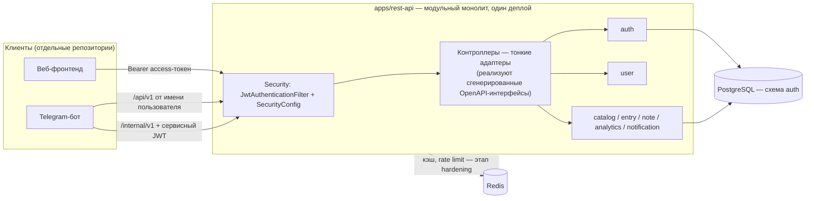
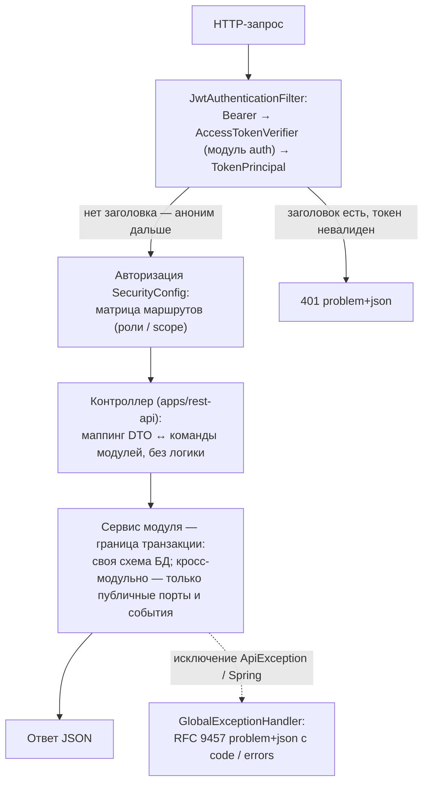

# Как работает система

> Обзор Aura целиком в рантайме: компоненты, путь HTTP-запроса, сквозные сценарии, данные, конфигурация и состояние реализации. Этот документ — «стартовая точка» и карта документации.
> Проектные решения и границы модулей — [architecture-overview.md](architecture-overview.md), REST-контракт — [api-design.md](api-design.md).

## 1. Карта документации

### Общие документы

| Документ | О чём |
|---|---|
| [architecture-overview.md](architecture-overview.md) | модульные границы, события, стратегия распила на микросервисы |
| [domain-model.md](domain-model.md) | сущности, ERD, жизненный цикл записи, таймзоны |
| [api-design.md](api-design.md) | конвенции REST, эндпоинты, ошибки, internal-API |
| [spec-first-workflow.md](spec-first-workflow.md) | OpenAPI-спека как источник истины, генерация кода |
| [gradle-structure.md](gradle-structure.md) | multi-module, `libs.versions.toml`, convention-плагины |
| [liquibase-migrations.md](liquibase-migrations.md) | организация миграций по модулям |
| [telegram-bot.md](telegram-bot.md) | архитектура бота, связка аккаунтов, напоминания |
| [local-dev.md](local-dev.md) | docker-compose, запуск, переменные окружения |
| [roadmap.md](roadmap.md) | этапы реализации с критериями готовности |

### Документы модулей (`docs/modules/`)

Каждый доменный модуль описывается отдельным файлом `docs/modules/<module>.md`: публичный контракт, внутреннее устройство, схема БД, потоки, тесты.

| Модуль | Документ |
|---|---|
| `auth` | [modules/auth.md](modules/auth.md) |
| `user`, `catalog`, `entry`, `note`, `analytics`, `notification` | появляются вместе с реализацией модулей (этапы 2–7) |

## 2. Состав системы

Aura — трекер эмоций: пользователь 1–3 раза в день фиксирует эмоции, факторы, события и метрики; по данным строятся графики и связи. Три части:

| Часть | Где живёт | Как общается с core |
|---|---|---|
| **REST API (монолит)** | этот репозиторий, `apps/rest-api` — единственный деплой | — |
| **Веб-фронтенд** | отдельный репозиторий | REST `/api/v1` + пользовательский JWT |
| **Telegram-бот** | отдельный репозиторий (`aura-telegram-bot`) | REST `/api/v1` (от имени пользователя) + `/internal/v1` (сервисный JWT) |

Контракт для обоих клиентов — публикуемая OpenAPI-спека ([spec-first-workflow.md](spec-first-workflow.md)). Бот своей БД не имеет — все данные в core.

### Состояние реализации (по [roadmap.md](roadmap.md))

- **Готово:** этап 0 (каркас) и этап 1 — модули `shared`, `auth`, `user`; регистрация/вход/refresh/logout, `/me`, internal service-token, коды связки Telegram.
- **Дальше:** `catalog` (этап 2) → `entry` (3) → `note` (4) → `analytics` (5) → бот (6, отдельный репозиторий) → `notification` (7) → hardening (8). Нереализованные части ниже помечены как «план».

## 3. Путь HTTP-запроса

1. **Аутентификация.** `JwtAuthenticationFilter` проверяет `Authorization: Bearer …` через порт `AccessTokenVerifier` модуля auth. Результат — `TokenPrincipal` (тип, userId, роли, scope'ы), который превращается в authorities `ROLE_*` / `SCOPE_*`. Пользовательский токен открывает `/api/v1/**`, сервисный (`scope=internal`) — `/internal/**`; они взаимозаменяемыми не являются.
2. **Авторизация.** Публичные: `auth/register|login|refresh|logout`, `/internal/v1/auth/service-token`, документация, `/actuator/health`. Всё остальное под `/api/v1` — роли `USER`/`ADMIN`; `/internal/**` — только сервисный токен; прочие маршруты — `denyAll`.
3. **Контроллеры** реализуют интерфейсы, сгенерированные из `api/openapi/api.yaml`, и только переложают данные между DTO спеки и командами/моделями модулей.
4. **Сервис модуля** — граница `@Transactional` и единственное место бизнес-логики; репозитории модуля имеют доступ только к своей схеме. Чужие данные — через публичные порты (`….<module>.api`) и события; это проверяют Modulith verification и ArchUnit-тесты.
5. **Ошибки** — всегда RFC 9457 `application/problem+json` с расширениями `code` и `errors` (контракт — [api-design.md](api-design.md)).

Детали security-контура — [modules/auth.md](modules/auth.md) §6.

## 4. Сквозные сценарии

### 4.1 Сессия веб-клиента (реализовано)

1. `POST /api/v1/auth/register {email, password, timezone?}` → 201 `{user, accessToken, refreshToken}` (повторные входы — `login`).
2. Каждый запрос — `Authorization: Bearer <accessToken>`; access живёт 15 минут.
3. По истечении — 401 → `POST /api/v1/auth/refresh {refreshToken}` → новая пара; старый refresh отозван (ротация).
4. Предъявить уже отозванный refresh → 401 `REFRESH_TOKEN_REUSE`: отозвана вся цепочка, требуется повторный вход (защита от кражи токена).
5. Выход — `POST /api/v1/auth/logout` (идемпотентно отзывает refresh).

Параллельно профиль доступен через `GET/PATCH /api/v1/me` и `PUT /api/v1/me/password`: контроллер → модуль `user` (`UserProfilePort`) → модуль `auth` (`UserAccountPort`, владелец данных).

### 4.2 Привязка Telegram и вход через бота (реализовано на стороне core)

1. Пользователь в вебе: `POST /api/v1/auth/telegram/link-code` → одноразовый код на 10 минут.
2. Пользователь вводит код боту; бот (под сервисным JWT) вызывает `/internal/v1/auth/telegram/link` — аккаунт связан (`auth.users.telegram_id` = chat_id личного чата).
3. При последующих входах бот вызывает `/internal/v1/auth/telegram/exchange` и получает краткоживущий **пользовательский** access-токен, которым ходит в `/api/v1` от имени пользователя; `/internal/**` при этом использует отдельный сервисный JWT по clientId/clientSecret.

Полная диаграмма и правила кодов — [modules/auth.md](modules/auth.md) §4.3–4.4, архитектура бота — [telegram-bot.md](telegram-bot.md).

### 4.3 Чек-ин — запись эмоций (план, этапы 2–4)

1. Клиент берёт справочники из `catalog` (системные пресеты + персональные элементы).
2. `POST /api/v1/entries {emotions[{id, intensity, influence}], factors, events, metrics, note?}` — модуль `entry` валидирует по справочникам через публичный порт `catalog`, вычисляет `entry_date` по таймзоне пользователя (лимит 5 записей/сутки).
3. Завершение записи публикует факт `EntryCompleted`: `analytics` пересчитывает агрегаты, `notification` закрывает «напоминание на сегодня». Заметки — в `note` (свободные или привязанные к записи).

### 4.4 Напоминания (план, этап 7)

`notification` хранит расписания (1–3 локальных времени) и формирует очередь «due»; бот периодически опрашивает `/internal/v1/notifications/due?channel=telegram`, отправляет сообщения в Telegram и подтверждает отправку (`POST /internal/v1/notifications/{id}/ack`). Пользователь управляет расписанием через `PUT /api/v1/reminders/schedule`.

## 5. Данные

PostgreSQL — единственный источник истины; Redis — только кэш и rate limiting (не источник истины). Схема на модуль, миграции — Liquibase внутри каждого модуля ([liquibase-migrations.md](liquibase-migrations.md)).

| Схема | Модуль | Таблицы | Статус |
|---|---|---|---|
| `auth` | auth | `users`, `refresh_tokens`, `telegram_link_codes`, `service_clients` (+seed бота) | готово |
| `catalog` | catalog | эмоции/факторы/события/метрики («системное + персональное») | план |
| `entry` | entry | чек-ины и вложенные коллекции | план |
| `note` | note | заметки, шаблоны | план |
| `notification` | notification | расписания и due-очередь | план |
| `liquibase` | — | служебная (`DATABASECHANGELOG`) | готово |

Правила: `timestamptz` в UTC; `entry_date` — локальная дата пользователя, вычисляется по его IANA-таймзоне из профиля; никаких JOIN и FK между схемами разных модулей — ссылки по идентификаторам. Доменные сущности и ERD — [domain-model.md](domain-model.md).

## 6. Конфигурация и окружение

| Параметр | Значение по умолчанию (local) | Заметки |
|---|---|---|
| `SPRING_DATASOURCE_*` | `jdbc:postgresql://localhost:5432/aura`, `aura`/`aura` | docker-compose |
| `JWT_SECRET` | dev-значение из `application-local.yml` (≥ 32 байт) | в проде задаётся всегда; короче — приложение не стартует |
| `aura.security.jwt.*-ttl` | access 15m / refresh 30d / service 24h | переопределяются конфигом |
| Сервисные креды бота | `aura-telegram-bot` / `aura-bot-dev-secret` | seed-чейнджлог `auth-900`, в БД только SHA-256 хэш |
| Профиль | `local` — по умолчанию | прод обязан задавать `SPRING_PROFILES_ACTIVE` |

Полная инструкция запуска — [local-dev.md](local-dev.md). Прод-хардening (rate limiting, RS256 + JWKS, метрики/трейсинг) — этап 8 [roadmap.md](roadmap.md).

## 7. Целостность системы

Границы и контракты удерживаются автоматикой, а не договорённостями:

- **Spring Modulith verification + ArchUnit** (в `apps/rest-api`) — модуль наружу отдаёт только `….<module>.api`, никаких обращений к чужим `internal`.
- **OpenAPI spec-first** — сервер, фронтенд и бот собираются из одной спеки; ручные DTO запрещены.
- **Liquibase** — изменения схемы только чейнджлогами внутри модулей; применённые changesets не редактируются.
- **`./gradlew build`** = тесты (Testcontainers) + detekt; Postman-коллекция в корне обновляется вместе с эндпоинтами.
